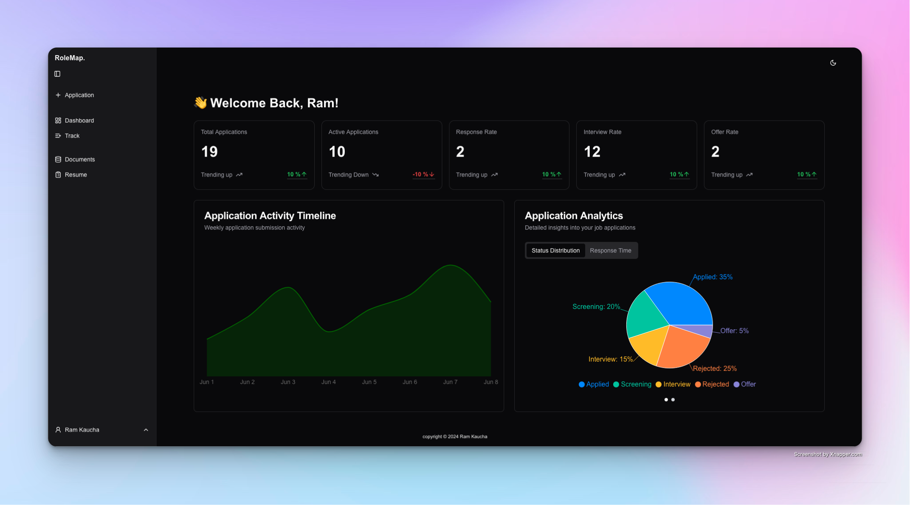
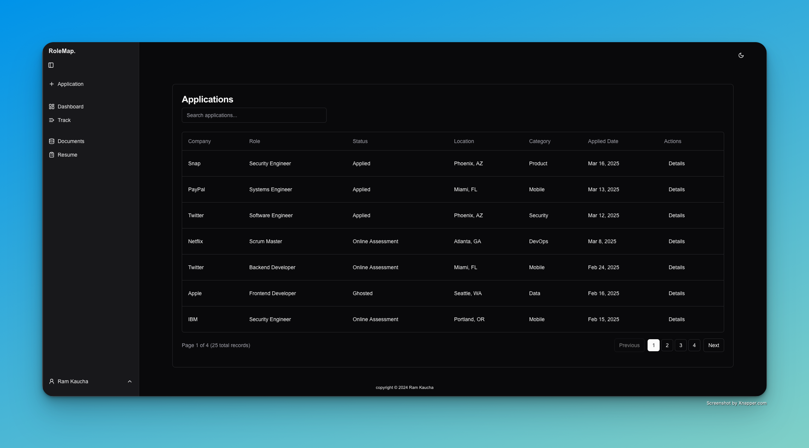

# RoleMap

RoleMap is a application management system designed to modernise and simplify the job searching process. This is an all-in-one platform that combines intelligent tracking, document management and automation tools that help job seekers maintain an organised and effective job search campaign.




## Table of Contents

- [Installation](#installation)
- [Usage](#usage)
- [Docker Setup](#-docker-setup)
- [Tech Stack](#️-tech-stack)

## 🚀 Getting Started

Prerequisites
Before you begin, ensure you have the following installed:

[](https://www.npmjs.com/)
[](https://nodejs.org/)

## Installation

1. Clone the repo:

```bash
  git clone git@github.com:ramkaucha/RoleMap.git
  cd RoleMap
```

2. Install dependences:

Backend services:

```bash
cd backend/
pip install -r requirements.txt
```

```bash
cd frontend/
npm install
```

## Usage

To run the project, use the following command:

```bash
cd backend/
python -m app.main

cd frontend/
npm run dev
```

## 🐳 Docker Setup

RoleMap can be run using Docker for a consistent development environment.

### Prerequisites

- Docker and Docker Compose

### Running with Docker

First initializing:

```bash
./
docker-compose up --build
```

Starting the containers again:

```bash
docker-compose up
```

Stop the containers:

```bash
docker-compose down
```

## 🛠️ Tech Stack

[](https://nextjs.org/)
[](https://reactjs.org/)
[](https://www.typescriptlang.org/)
[](https://tailwindcss.com/)
[](https://ui.shadcn.com/)
[](https://tanstack.com/query/latest)
[](https://tanstack.com/table/latest)
[](https://www.framer.com/motion/)
[](https://fastapi.tiangolo.com/)
[](https://www.sqlalchemy.org/)
[](https://www.postgresql.org/)
[](https://www.python.org/)
[](https://jwt.io/)
[](https://oauth.net/2/)
[](https://next-auth.js.org/)
[](https://www.docker.com/)
